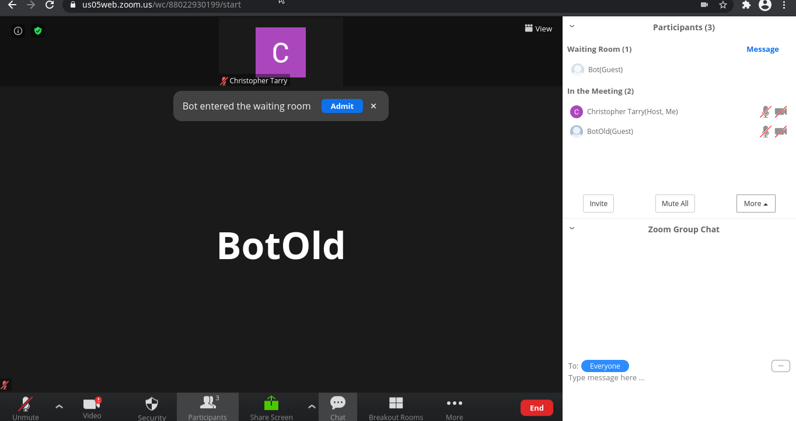

## Recording video/audio from video conferencing calls
If you’re looking to use this repo to retrieve video or audio streams from meeting platforms like Zoom, Google Meet, Microsoft Teams, consider checking out [Recall.ai](https://www.recall.ai), an API for meeting recording.

# zoomer - Bot library for Zoom meetings

Good bot support is part of what makes Discord so nice to use.  Unfortunately, the official Zoom API is basically only useful for scheduling meetings and using Zoom Chat, not for making [in-meeting](https://devforum.zoom.us/t/in-meeting-chat-api/39948/4) bots.  So I decided to bring this feature to Zoom myself.

Here is a demo of a basic, ~130 lines of code bot:


## WEB SDK

I created this by reverse engineering the Zoom Web SDK.  Regular web joins are captcha-gated but web SDK joins [are not](https://devforum.zoom.us/t/remove-recaptcha-on-webinars-websdk1-7-9/23054/25).  I use an API only used by the Web SDK to get tokens needed to join the meeting.  This means you need a Zoom API key/secret, specifically a "Meeting SDK" one.  These can be obtained on the Zoom [App Marketplace](https://marketplace.zoom.us/develop/create) site: click Meeting SDK (Create) -> name app, disable publishing to marketplace -> fill descriptions and contact information with anything you want -> click App Credentials.  The demo at `cmd/zoomer/main.go` reads these from the environment as `ZOOM_API_KEY` and `ZOOM_API_SECRET`.

### NOTE
Because the API keys are associated with your account, using this software may get your Zoom account banned (reverse engineering is against the Zoom Terms of Service).  Please do not use this on an important account.


## PLAY WITH DEMO

```
$ go get github.com/chris124567/zoomer
$ cd $GOPATH/src/github.com/chris124567/zoomer
$ scripts/build.sh
$ ZOOM_API_KEY="xxx" ZOOM_API_SECRET="xxx" ./zoomer -meetingNumber xxxxx -password xxxxx
```

Feel free to use the demo as a template.  If you want to use the library elsewhere just import `github.com/chris124567/zoomer/pkg/zoom`.

### DEMO WALKTHROUGH
See the comments in `cmd/zoomer/main.go`

## FEATURES / SUPPORTED MESSAGE TYPES
| Feature                                                                                                            | Send/recv | Message Name                              | Function (if send) / struct type (if recv) | Host Required               | Tested |
| ------------------------------------------------------------------------------------------------------------------ | --------- | ----------------------------------------- | ------------------------------------------ | --------------------------- | ------ |
| Send a chat message                                                                                                | Send      | WS\_CONF\_CHAT\_REQ                       | ZoomSession.SendChatMessage                | No                          | Yes    |
| Pretend to "join audio"                                                                                            | Send      | WS\_AUDIO\_VOIP\_JOIN\_CHANNEL\_REQ       | ZoomSession.JoinAudioVoipChannel           | No                          | Yes    |
| Pretend to turn on/off video (if enabled camera indicator appears to be on but actually just shows a black screen) | Send      | WS\_VIDEO\_MUTE\_VIDEO\_REQ               | ZoomSession.SetVideoMuted                  | No                          | Yes    |
| Pretending to screen share (shows "x" is sharing their screen but is just a black screen)                          | Send      | WS\_CONF\_SET\_SHARE\_STATUS\_REQ         | ZoomSession.SetScreenShareMuted            | Depending on share settings | Yes    |
| Pretend to turn on/off audio (if enabled audio indicator appears to be on but no audio is actually outputted)      | Send      | WS\_AUDIO\_MUTE\_REQ                      | ZoomSession.SetAudioMuted                  | No                          | Yes    |
| Rename self                                                                                                        | Send      | WS\_CONF\_RENAME\_REQ                     | ZoomSession.RenameMe                       | Depending on settings       | Yes    |
| Rename others                                                                                                      | Send      | WS\_CONF\_RENAME\_REQ                     | ZoomSession.RenameById                     | Yes                         | No     |
| Request everyone mutes themselves                                                                                  | Send      | WS\_AUDIO\_MUTEALL\_REQ                   | ZoomSession.RequestAllMute                 | Yes                         | No     |
| Set mute upon entry status                                                                                         | Send      | WS\_CONF\_SET\_MUTE\_UPON\_ENTRY\_REQ     | ZoomSession.SetMuteUponEntry               | Yes                         | No     |
| Set allow unmuting audio                                                                                           | Send      | WS\_CONF\_ALLOW\_UNMUTE\_AUDIO\_REQ       | ZoomSesssion.SetAllowUnmuteAudio           | Yes                         | No     |
| Set allow participant renaming                                                                                     | Send      | WS\_CONF\_ALLOW\_PARTICIPANT\_RENAME\_REQ | ZoomSession.SetAllowParticipantRename      | Yes                         | No     |
| Set chat restrictions level                                                                                        | Send      | WS\_CONF\_CHAT\_PRIVILEDGE\_REQ           | ZoomSession.SetChatLevel                   | Yes                         | Yes    |
| Set screen sharing locked status                                                                                   | Send      | WS\_CONF\_LOCK\_SHARE\_REQ                | ZoomSession.SetShareLockedStatus           | Yes                         | No     |
| End meeting                                                                                                        | Send      | WS\_CONF\_END\_REQ                        | ZoomSession.EndMeeting                     | Yes                         | No     |
| Set allow unmuting video                                                                                           | Send      | WS\_CONF\_ALLOW\_UNMUTE\_VIDEO\_REQ       | ZoomSession.SetAllowUnmuteVideo            | Yes                         | No     |
| Request breakout room join token                                                                                   | Send      | WS\_CONF\_BO\_JOIN\_REQ                   | ZoomSession.RequestBreakoutRoomJoinToken   | No                          | Yes    |
| Breakout room broadcast                                                                                            | Send      | WS\_CONF\_BO\_BROADCAST\_REQ              | ZoomSession.BreakoutRoomBroadcast          | Yes                         | No     |
| Request a token for creation of a breakout room                                                                    | Send      | WS\_CONF\_BO\_TOKEN\_BATCH\_REQ           | ZoomSession.RequestBreakoutRoomToken       | Yes                         | Yes    |
| Create a breakout room                                                                                             | Send      | WS\_CONF\_BO\_START\_REQ                  | ZoomSession.CreateBreakoutRoom             | Yes                         | No     |
| Join information (user ID, participant ID and some other stuff)                                                    | Recv      | WS\_CONF\_JOIN\_RES                       | JoinConferenceResponse                     |                             | Yes    |
| Breakout room creation token response (response to WS\_CONF\_BO\_TOKEN\_BATCH\_REQ)                                | Recv      | WS\_CONF\_BO\_TOKEN\_RES                  | ConferenceBreakoutRoomTokenResponse        |                             | Yes    |
| Breakout room join response                                                                                        | Recv      | WS\_CONF\_BO\_JOIN\_RES                   | ConferenceBreakoutRoomJoinResponse         |                             | Yes    |
| Permission to show avatars changed                                                                                 | Recv      | WS\_CONF\_AVATAR\_PERMISSION\_CHANGED     | ConferenceAvatarPermissionChanged          |                             | Yes    |
| Roster change (mute/unmute, renames, leaves/joins)                                                                 | Recv      | WS\_CONF\_ROSTER\_INDICATION              | ConferenceRosterIndication                 |                             | Yes    |
| Meeting attribute setting (stuff like "is sharing allowed" or "is the meeting locked")                             | Recv      | WS\_CONF\_ATTRIBUTE\_INDICATION           | ConferenceAttributeIndication              |                             | Yes    |
| Host change                                                                                                        | Recv      | WS\_CONF\_HOST\_CHANGE\_INDICATION        | ConferenceHostChangeIndication             |                             | Yes    |
| Cohost change                                                                                                      | Recv      | WS\_CONF\_COHOST\_CHANGE\_INDICATION      | ConferenceCohostChangeIndication           |                             | Yes    |
| "Hold" state (waiting rooms)                                                                                       | Recv      | WS\_CONF\_HOLD\_CHANGE\_INDICATION        | ConferenceHoldChangeIndication             |                             | Yes    |
| Chat message                                                                                                       | Recv      | WS\_CONF\_CHAT\_INDICATION                | ConferenceChatIndication                   |                             | Yes    |
| Meeting "option" parameter (used for waiting room and breakout rooms)                                              | Recv      | WS\_CONF\_OPTION\_INDICATION              | ConferenceOptionIndication                 |                             | Yes    |
| ??? Local Record Indication ???                                                                                    | Recv      | WS\_CONF\_LOCAL\_RECORD\_INDICATION       | ConferenceLocalRecordIndication            |                             | Yes    |
| Breakout room command (forcing you to join a room, broadcasts)                                                     | Recv      | WS\_CONF\_BO\_COMMAND\_INDICATION         | ConferenceBreakoutRoomCommandIndication    |                             | Yes    |
| Breakout room attributes (settings and list of rooms)                                                              | Recv      | WS\_CONF\_BO\_ATTRIBUTE\_INDICATION       | ConferenceBreakoutRoomAttributeIndication  |                             | Yes    |
| Datacenter Region                                                                                                  | Recv      | WS\_CONF\_DC\_REGION\_INDICATION          | ConferenceDCRegionIndication               |                             | Yes    |
| ??? Audio Asn ???                                                                                                  | Recv      | WS\_AUDIO\_ASN\_INDICATION                | AudioAsnIndication                         |                             | Yes    |
| ??? Audio Ssrc ???                                                                                                 | Recv      | WS\_AUDIO\_SSRC\_INDICATION               | AudioSSRCIndication                        |                             | Yes    |
| Someone has enabled video                                                                                          | Recv      | WS\_VIDEO\_ACTIVE\_INDICATION             | VideoActiveIndication                      |                             | Yes    |
| ??? Video Ssrc ???                                                                                                 | Recv      | WS\_VIDEO\_SSRC\_INDICATION               | SSRCIndication                             |                             | Yes    |
| Someone is sharing their screen                                                                                    | Recv      | WS\_SHARING\_STATUS\_INDICATION           | SharingStatusIndication                    |                             | Yes    |


Note that you are free to construct your own message types for any I have not implemented.

For sending: Look at `zoom/requests.go` and switch out the struct and message type names for your new message type

For receiving: Create a definition for the type and update the getPointerForBody function in `zoom/message.go.`

## INFORMATION ON PROTOCOL
The protocol used by the Zoom Web client is basically just JSON over Websockets.  The messages look something like this:

```
{"body":{"bCanUnmuteVideo":true},"evt":7938,"seq":44}
{"body":{"add":null,"remove":null,"update":[{"audio":"","bAudioUnencrytped":false,"id":16785408}]},"evt":7937,"seq":47}
{"body":{"add":null,"remove":null,"update":[{"caps":5,"id":16785408,"muted":true}]},"evt":7937,"seq":63}
{"body":{"dc":"the United States(SC)","network":"Zoom Global Network","region":"the United States"},"evt":7954,"seq":3}
```

The "evt" number specifies the event number.  There is a (mostly complete) list of these in `zoom/constant.go` that I extracted from javascript code on the meeting page.

For the above three messages, the types are:
```
WS_CONF_ATTRIBUTE_INDICATION                     = 7938 // ConferenceAttributeIndication
WS_CONF_ROSTER_INDICATION                        = 7937 // ConferenceRosterIndication
WS_CONF_DC_REGION_INDICATION                     = 7954 // ConferenceDCRegionIndication
```
The thing in the comments to the right is the struct type for that message, which can be found in `zoom/message_types.go`.

Also, the server and client both have sequence numbers ("seq") for the messages they send but it doesn't appear to be used for anything (?).

## TODO (DESCENDING ORDER OF PRIORITY)
- Gracefully exit/disconnect
- Organize `zoom/message_types.go` and general refactoring
- Support for meetings where you don't have the password but just a Zoom url with the "pwd" parameter in it (anyone know anything about this??)
- Thoroughly test things
- Make it more extensible
- Joining breakout room support
- More comments and documentation
- Support audio/video

## REMARK ON MAINTENANCE AND STABILITY
This is hobbyist software that has no guarantees of being maintained or supported.  Please don't use it anywhere near production.
